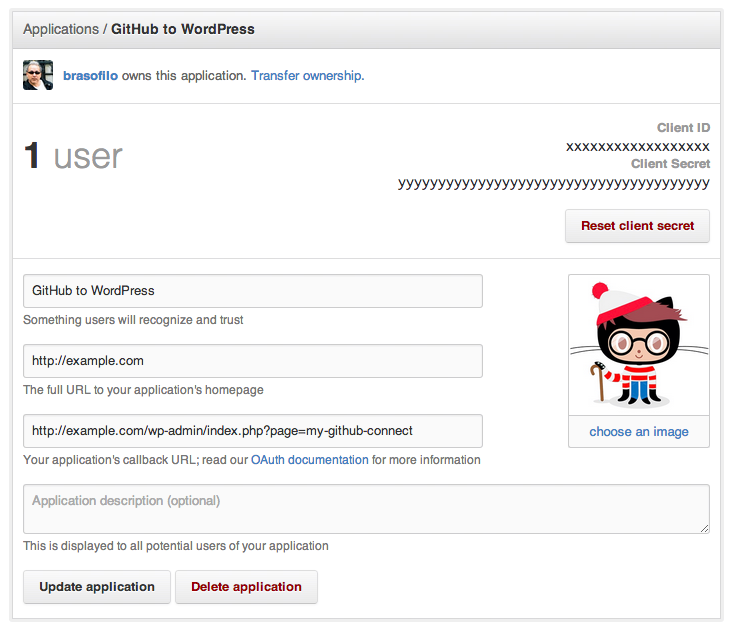
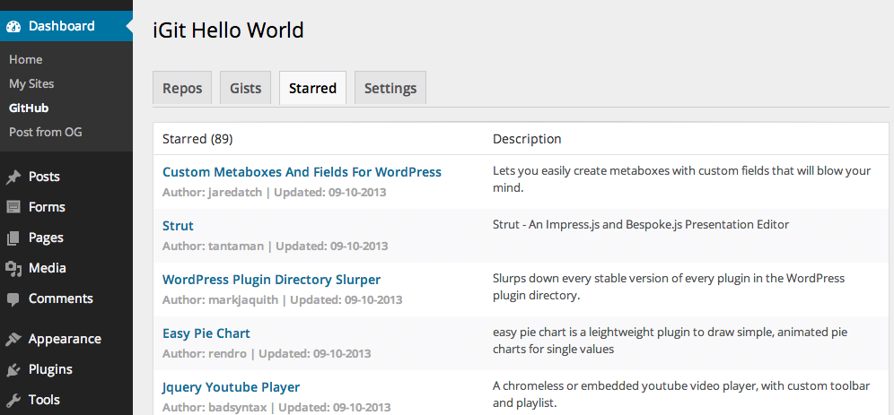

Github Plugin for WordPress
===========================

Basic information about your repositories and its Forks and Watchers.

For the frontend, use the shortcode `[github_oauth]`.

##Screenshots

**Register your App in GitHub, put your site and the plugin's page**:  
> 

**Backend after authentication**:  
> 

##Acknowledgments

Based on original code by [Developer Drive](http://www.developerdrive.com/2013/06/github-plug-in-for-wordpress/).

Main changes:

- Encapsulated into pro Plugin Class
- Moved check_oauth into own function, loaded at plugin init
- No need to load core files
- Added cache with transients
- Menu moved to Dashboard
- Admin URL set as class property
- Moved all Styles enqueue inside the Shortcode. Yes, it's possible.
- Changed get_template_directory_uri for plugins_url
- Updated link to API registration

##Changelog

### 2013.10.09

* Initial Public Release

##Credits

This plugin is built and maintained by [Rodolfo Buaiz](http://brasofilo.com), aka brasofilo.

##License

This program is free software; you can redistribute it and/or modify it under the terms of the GNU General Public License as published by the Free Software Foundation; either version 2 of the License, or (at your option) any later version.

This program is distributed in the hope that it will be useful, but WITHOUT ANY WARRANTY; without even the implied warranty of MERCHANTABILITY or FITNESS FOR A PARTICULAR PURPOSE.  See the GNU General Public License for more details.

You should have received a copy of the GNU General Public License along with this program; if not, write to:

Free Software Foundation, Inc.
51 Franklin Street, Fifth Floor,
Boston, MA
02110-1301, USA.